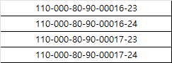

 



* 춘천시 평잔보고서
```sql
SELECT  
    A.HOIGYE_CODE,
    A.GONGGEUM_GYEJWA,
    A.GONGGEUM_GYEJWA_NM,
    A.GONGGEUM,
    A.JUCHUK,
    A.MMDA
FROM (SELECT T2.HOIGYE_CODE
           , T2.GONGGEUM_GYEJWA
           , T2.GONGGEUM_GYEJWA_NM
           , NVL(TRUNC(SUM(T1.GONGGEUM) / MAX(T3.DAYS_CNT), 0), 0) AS GONGGEUM
           , NVL(TRUNC(SUM(T1.UNYONG) / MAX(T3.DAYS_CNT), 0), 0)   AS JUCHUK
           , NVL(TRUNC(SUM(T1.MMDA) / MAX(T3.DAYS_CNT), 0), 0)     AS MMDA
      FROM (SELECT T1.HOIGYE_CODE
                 , T1.GONGGEUM_GYEJWA
                 , T1.TRX_DT
                 , T1.BIZ_DT
                 , T1.JANAEK AS GONGGEUM
                 , 0         AS UNYONG
                 , 0         AS MMDA
            FROM (SELECT T1.HOIGYE_CODE
                       , T1.GONGGEUM_GYEJWA
                       , T2.DW_BAS_DDT                                AS TRX_DT
                       , DECODE(T2.DT_G, 0, T2.BIZ_DT, T2.BF1_BIZ_DT) AS BIZ_DT
                       , T1.JANAEK
                  FROM RPT_GONGGEUM_JAN T1
                     , MAP_JOB_DATE T2
                  WHERE 1 = 1
                    AND T1.KEORAEIL = DECODE(T2.DT_G, 0, T2.BIZ_DT, T2.BF1_BIZ_DT)
                    AND T1.GEUMGO_CODE = '110'
                    AND T1.GUNGU_CODE = 0
                    AND T2.DW_BAS_DDT >= '20240101'
                    AND T2.DW_BAS_DDT <= '20241231') T1
               , ACL_SIGUMGO_MAS T2
               , RPT_AC_BY_HOIKYE_MAPP T3
            WHERE 1 = 1
              AND T1.GONGGEUM_GYEJWA = T2.FIL_100_CTNT2
              AND T2.FIL_100_CTNT2 = T3.SIGUMGO_ACNO
              AND T2.SIGUMGO_HOIKYE_YR = T3.SIGUMGO_HOIKYE_YR
              AND T2.MNG_NO = 1
              AND (
                      CASE
                          WHEN T2.SIGUMGO_HOIKYE_YR = '9999' AND SUBSTR(T1.TRX_DT, 1, 4) = '2024'
                              THEN 1
                          WHEN T2.SIGUMGO_HOIKYE_YR = '2024'
                              THEN 1
                          ELSE 0
                          END
                      ) = 1
            UNION ALL
            SELECT T1.HOIGYE_CODE
                 , T1.GONGGEUM_GYEJWA
                 , T1.TRX_DT
                 , T1.BIZ_DT
                 , 0 AS GONGGEUM
                 , CASE
                       WHEN '2024' > '2021'
                           THEN
                           CASE
                               WHEN T1.TRX_DT >= NVL(T2.KIJUNIL, '99991231') THEN 0
                               ELSE NVL(T1.JANAEK, 0)
                               END
                       ELSE NVL(T1.JANAEK, 0)
                END  AS UNYONG
                 , 0 AS MMDA
            FROM (SELECT TO_NUMBER(T3.SIGUMGO_HOIKYE_C) AS HOIGYE_CODE
                       , T2.FIL_100_CTNT2               AS GONGGEUM_GYEJWA
                       , T1.TRX_DT
                       , T1.BIZ_DT
                       , T1.JANAEK
                       , T2.SIGUMGO_HOIKYE_YR           AS HOIGYE_YEAR
                       , CASE
                             WHEN T2.SIGUMGO_HOIKYE_YR = '9999' AND T1.GONGGEUM_GYEJWA = T2.FIL_100_CTNT2
                                 THEN 'Y'
                             WHEN T2.SIGUMGO_HOIKYE_YR = '2024' AND T1.GONGGEUM_GYEJWA <= T2.FIL_100_CTNT2
                                 THEN 'Y'
                             ELSE 'N'
                    END                                 AS TRGT_YN
                  FROM (SELECT T2.GONGGEUM_GYEJWA
                             , SUBSTR(T2.GONGGEUM_GYEJWA, 1, 15) AS GONGGEUM_GYEJWA_15
                             , T1.JANAEK
                             , T1.TRX_DT
                             , T1.BIZ_DT
                             , CASE
                                   WHEN T1.TRX_DT >= SUBSTR(NVL(T2.MKDT, T2.IN_DATE), 1, 8)
                                       AND T1.TRX_DT < NVL(T2.OUT_DATE, '99991231')
                                       AND T1.TRX_DT < NVL(T2.HJI_DT, '99991231')
                                       THEN 'Y'
                                   ELSE 'N'
                          END                                    AS TRGT_YN
                        FROM (SELECT T1.GONGGEUM_GYEJWA
                                   , T1.UNYONG_GYEJWA
                                   , T2.DW_BAS_DDT                                AS TRX_DT
                                   , DECODE(T2.DT_G, 0, T2.BIZ_DT, T2.BF1_BIZ_DT) AS BIZ_DT
                                   , T1.JANAEK
                              FROM RPT_UNYONG_JAN T1
                                 , MAP_JOB_DATE T2
                              WHERE 1 = 1
                                AND T1.KIJUNIL = DECODE(T2.DT_G, 0, T2.BIZ_DT, T2.BF1_BIZ_DT)
                                AND T1.GEUMGO_CODE = '110'
                                AND T2.DW_BAS_DDT >= '20240101'
                                AND T2.DW_BAS_DDT <= '20241231') T1
                           , RPT_UNYONG_GYEJWA T2
                           , (SELECT T1.FIL_100_CTNT2 AS GONGGEUM_GYEJWA
                                   , T2.KIJUNIL
                              FROM ACL_SIGUMGO_MAS T1
                                 , (SELECT T1.SIGUMGO_ORG_C
                                         , T1.GONGGEUM_GYEJWA
                                         , T1.ICH_SIGUMGO_GUN_GU_C
                                         , T1.ICH_SIGUMGO_HOIKYE_C
                                         , T1.SIGUMGO_AC_B
                                         , T1.SIGUMGO_AC_SER
                                         , T1.SIGUMGO_HOIKYE_YR
                                         , T2.KIJUNIL
                                    FROM (SELECT T1.SIGUMGO_ORG_C
                                               , T1.FIL_100_CTNT2 AS GONGGEUM_GYEJWA
                                               , T1.ICH_SIGUMGO_GUN_GU_C
                                               , T1.ICH_SIGUMGO_HOIKYE_C
                                               , T1.SIGUMGO_AC_B
                                               , T1.SIGUMGO_AC_SER
                                               , T1.SIGUMGO_HOIKYE_YR
                                          FROM ACL_SIGUMGO_MAS T1
                                          WHERE 1 = 1
                                            AND T1.SIGUMGO_ORG_C = '110'
                                            AND T1.SIGUMGO_HOIKYE_YR = '2024'
                                            AND T1.MNG_NO = 1) T1
                                       , RPT_HOIGYE_IWOL T2
                                    WHERE 1 = 1
                                      AND T1.SIGUMGO_ORG_C = T2.GEUMGO_CODE
                                      AND T1.ICH_SIGUMGO_GUN_GU_C = T2.GUNGU_CODE
                                      AND T1.SIGUMGO_HOIKYE_YR = TO_CHAR(T2.HOIGYE_YEAR + 1)
                                      AND T2.KIJUNIL <= '20241231'
                                      AND T2.HOIGYE_CODE IN (SELECT TO_NUMBER(T3.SIGUMGO_HOIKYE_C)
                                                             FROM RPT_AC_BY_HOIKYE_MAPP T3
                                                             WHERE 1 = 1
                                                               AND T3.SIGUMGO_ACNO = T1.GONGGEUM_GYEJWA)) T2
                              WHERE 1 = 1
                                AND T1.SIGUMGO_ORG_C = T2.SIGUMGO_ORG_C
                                AND T1.ICH_SIGUMGO_GUN_GU_C = T2.ICH_SIGUMGO_GUN_GU_C
                                AND T1.ICH_SIGUMGO_HOIKYE_C = T2.ICH_SIGUMGO_HOIKYE_C
                                AND T1.SIGUMGO_AC_B = T2.SIGUMGO_AC_B
                                AND T1.SIGUMGO_AC_SER = T2.SIGUMGO_AC_SER
                                AND T1.SIGUMGO_HOIKYE_YR < T2.SIGUMGO_HOIKYE_YR
                                AND T1.SIGUMGO_ORG_C = '110'
                                AND T1.MNG_NO = 1
                              UNION
                              SELECT T1.FIL_100_CTNT2 AS GONGGEUM_GYEJWA
                                   , '19000101'       AS KIJUNIL
                              FROM ACL_SIGUMGO_MAS T1
                              WHERE 1 = 1
                                AND T1.SIGUMGO_ORG_C = '110'
                                AND T1.MNG_NO = 1
                                AND (
                                        CASE
                                            WHEN T1.SIGUMGO_HOIKYE_YR = '9999' AND SUBSTR('20241231', 1, 4) = '2024'
                                                THEN 1
                                            WHEN T1.SIGUMGO_HOIKYE_YR = '2024'
                                                THEN 1
                                            ELSE 0
                                            END
                                        ) = 1) T3
                        WHERE 1 = 1
                          AND T1.GONGGEUM_GYEJWA = T2.GONGGEUM_GYEJWA
                          AND T1.UNYONG_GYEJWA = T2.UNYONG_GYEJWA
                          AND T1.GONGGEUM_GYEJWA = T3.GONGGEUM_GYEJWA
                          AND T1.TRX_DT >= T3.KIJUNIL
                          AND T2.BANK_GUBUN = 0) T1
                     , ACL_SIGUMGO_MAS T2
                     , RPT_AC_BY_HOIKYE_MAPP T3
                  WHERE 1 = 1
                    AND T2.FIL_100_CTNT2 LIKE T1.GONGGEUM_GYEJWA_15 || '%'
                    AND T2.FIL_100_CTNT2 = T3.SIGUMGO_ACNO
                    AND T2.SIGUMGO_HOIKYE_YR = T3.SIGUMGO_HOIKYE_YR
                    AND T1.TRGT_YN = 'Y'
                    AND T2.MNG_NO = 1) T1
               , (SELECT T1.KIJUNIL
                       , T1.HOIGYE_YEAR
                       , T1.HOIGYE_CODE
                       , T1.GUNGU_CODE
                       , T1.GEUMGO_CODE
                       , SUM(T1.AMT1) AS AMT2
                  FROM RPT_HOIGYE_IWOL T1
                  WHERE 1 = 1
                    AND '2024' > '2021'
                    AND T1.HOIGYE_YEAR = '2024'
                    AND T1.GEUMGO_CODE = '110'
                    AND T1.GUNGU_CODE = 0
                    AND GUBUN_CODE = 2
                  GROUP BY T1.KIJUNIL
                         , T1.HOIGYE_YEAR
                         , T1.HOIGYE_CODE
                         , T1.GUNGU_CODE
                         , T1.GEUMGO_CODE
                  HAVING SUM(T1.AMT1) > 0) T2
            WHERE 1 = 1
              AND T1.HOIGYE_CODE = T2.HOIGYE_CODE(+)
              AND T1.HOIGYE_YEAR = T2.HOIGYE_YEAR(+)
              AND T1.TRGT_YN = 'Y'
            UNION ALL
            SELECT T1.GONGGEUM_HOIGYE_CODE
                 , T1.GONGGEUM_GYEJWA
                 , T1.TRX_DT
                 , T1.BIZ_DT
                 , 0         AS GONGGEUM
                 , 0         AS UNYONG
                 , T2.JANAEK AS MMDA
            FROM (SELECT DISTINCT T1.FIL_100_CTNT2               AS GONGGEUM_GYEJWA
                                , TO_NUMBER(T2.SIGUMGO_HOIKYE_C) AS GONGGEUM_HOIGYE_CODE
                                , T3.TRX_DT
                                , T3.BIZ_DT
                                , T3.DAYS_CNT
                  FROM ACL_SIGUMGO_MAS T1
                     , RPT_AC_BY_HOIKYE_MAPP T2
                     , (SELECT T1.DW_BAS_DDT                                AS TRX_DT
                             , DECODE(T1.DT_G, 0, T1.BIZ_DT, T1.BF1_BIZ_DT) AS BIZ_DT
                             , COUNT(1)                                        OVER() AS DAYS_CNT
                        FROM MAP_JOB_DATE T1
                        WHERE 1 = 1
                          AND T1.DW_BAS_DDT >= '20240101'
                          AND T1.DW_BAS_DDT <= '20241231') T3
                  WHERE 1 = 1
                    AND T1.FIL_100_CTNT2 = T2.SIGUMGO_ACNO
                    AND T1.SIGUMGO_HOIKYE_YR = T2.SIGUMGO_HOIKYE_YR
                    AND T1.SIGUMGO_ORG_C = '110'
                    AND (
                            CASE
                                WHEN T1.SIGUMGO_HOIKYE_YR = '9999' AND SUBSTR(T3.TRX_DT, 1, 4) = '2024'
                                    THEN 1
                                WHEN T1.SIGUMGO_HOIKYE_YR = '2024'
                                    THEN 1
                                ELSE 0
                                END
                            ) = 1) T1
               , RPT_UNYONG_JAN T2
            WHERE 1 = 1
              AND T1.GONGGEUM_GYEJWA = T2.GONGGEUM_GYEJWA
              AND T1.BIZ_DT = T2.KIJUNIL
              AND T2.UNYONG_GYEJWA = '000000000000'
            UNION ALL
            SELECT T1.HOIGYE_CODE
                 , T1.GONGGEUM_GYEJWA
                 , T1.TRX_DT
                 , T1.BIZ_DT
                 , 0         AS GONGGEUM
                 , T2.JANAEK AS UNYONG
                 , 0         AS MMDA
            FROM (SELECT T2.GONGGEUM_GYEJWA
                       , T2.UNYONG_GYEJWA
                       , T1.HOIGYE_CODE
                       , T1.TRX_DT
                       , T1.BIZ_DT
                       , T1.DAYS_CNT
                  FROM (SELECT T1.REF_D_C + 900 AS HOIGYE_CODE
                             , T1.REF_D_NM      AS GONGGEUM_GYEJWA
                             , T2.TRX_DT
                             , T2.BIZ_DT
                             , T2.DAYS_CNT
                        FROM RPT_CODE_INFO T1
                           , (SELECT T1.DW_BAS_DDT                                AS TRX_DT
                                   , DECODE(T1.DT_G, 0, T1.BIZ_DT, T1.BF1_BIZ_DT) AS BIZ_DT
                                   , COUNT(1)                                        OVER() AS DAYS_CNT
                              FROM MAP_JOB_DATE T1
                              WHERE 1 = 1
                                AND T1.DW_BAS_DDT >= '20240101'
                                AND T1.DW_BAS_DDT <= '20241231') T2
                        WHERE 1 = 1
                          AND T1.REF_L_C = 50
                          AND T1.REF_M_C = '110'
                          AND T1.YUHYO_YN = 0) T1
                     , RPT_UNYONG_GYEJWA T2
                  WHERE 1 = 1
                    AND T1.GONGGEUM_GYEJWA = T2.GONGGEUM_GYEJWA
                    AND T1.TRX_DT >= SUBSTR(NVL(T2.MKDT, T2.IN_DATE), 1, 8)
                    AND T1.TRX_DT < NVL(T2.OUT_DATE, '99991231')
                    AND T1.TRX_DT < NVL(T2.HJI_DT, '99991231')
                    AND SUBSTR(T1.TRX_DT, 1, 4) = '2024'
                    AND T2.BANK_GUBUN = 0) T1
               , RPT_UNYONG_JAN T2
            WHERE 1 = 1
              AND T1.GONGGEUM_GYEJWA = T2.GONGGEUM_GYEJWA
              AND T1.UNYONG_GYEJWA = T2.UNYONG_GYEJWA
              AND T1.BIZ_DT = T2.KIJUNIL) T1
         , (SELECT TO_NUMBER(T2.SIGUMGO_HOIKYE_C) AS HOIGYE_CODE
                 , T1.FIL_100_CTNT2               AS GONGGEUM_GYEJWA
                 , T1.SIGUMGO_AC_NM               AS GONGGEUM_GYEJWA_NM
                 , T1.SIGUMGO_HOIKYE_YR           AS GONGGEUM_HOIGYE_YEAR
            FROM ACL_SIGUMGO_MAS T1
               , RPT_AC_BY_HOIKYE_MAPP T2
            WHERE 1 = 1
              AND T1.FIL_100_CTNT2 = T2.SIGUMGO_ACNO
              AND T1.SIGUMGO_HOIKYE_YR = T2.SIGUMGO_HOIKYE_YR
              AND T1.SIGUMGO_ORG_C = '110'
              AND T1.SIGUMGO_HOIKYE_YR IN ('2024', '9999')
              AND T1.MNG_NO = 1
            UNION ALL
            SELECT 900 + T1.REF_D_C AS HOIGYE_CODE
                 , T1.REF_D_NM      AS GONGGEUM_GYEJWA
                 , T1.REF_CTNT1     AS GONGGEUM_GYEJWA_NM
                 , '9999'           AS GONGGEUM_HOIGYE_YEAR
            FROM RPT_CODE_INFO T1
            WHERE 1 = 1
              AND '110' = 110
              AND T1.REF_L_C = 50
              AND T1.REF_M_C = '110') T2
         , (SELECT COUNT(1) AS DAYS_CNT
            FROM MAP_JOB_DATE T1
            WHERE 1 = 1
              AND T1.DW_BAS_DDT >= '20240101'
              AND T1.DW_BAS_DDT <= '20241231') T3
      WHERE 1 = 1
        AND T1.GONGGEUM_GYEJWA(+) = T2.GONGGEUM_GYEJWA
        AND DECODE('110', 439, T2.GONGGEUM_HOIGYE_YEAR, 440, T2.GONGGEUM_HOIGYE_YEAR, 1) =
            DECODE('110', 439, '2024', 440, '2024', 1)

      GROUP BY T2.HOIGYE_CODE
             , T1.GONGGEUM_GYEJWA
             , T2.GONGGEUM_GYEJWA
             , T2.GONGGEUM_GYEJWA_NM
             , T2.GONGGEUM_HOIGYE_YEAR
      ORDER BY T2.HOIGYE_CODE
             , T1.GONGGEUM_GYEJWA
             , T2.GONGGEUM_GYEJWA
             , T2.GONGGEUM_GYEJWA_NM
             , T2.GONGGEUM_HOIGYE_YEAR UNION ALL

      SELECT
          T2.HOIGYE_CODE
              , T2.GONGGEUM_GYEJWA
              , T2.GONGGEUM_GYEJWA_NM
              , NVL(TRUNC(SUM (T1.GONGGEUM)/ MAX (T3.DAYS_CNT), 0), 0) AS GONGGEUM
              , NVL(TRUNC(SUM (T1.UNYONG)/ MAX (T3.DAYS_CNT), 0), 0) AS JUCHUK
              , NVL(TRUNC(SUM (T1.MMDA)/ MAX (T3.DAYS_CNT), 0), 0) AS MMDA
      FROM
          (
          SELECT
          T1.HOIGYE_CODE
              , T1.GONGGEUM_GYEJWA
              , T1.TRX_DT
              , T1.BIZ_DT
              , T1.JANAEK AS GONGGEUM
              , 0 AS UNYONG
              , 0 AS MMDA
          FROM
          (
          SELECT
          T1.HOIGYE_CODE
              , T1.GONGGEUM_GYEJWA
              , T2.DW_BAS_DDT AS TRX_DT
              , DECODE(T2.DT_G, 0, T2.BIZ_DT, T2.BF1_BIZ_DT) AS BIZ_DT
              , T1.JANAEK
          FROM
          RPT_GONGGEUM_JAN T1
              , MAP_JOB_DATE T2
          WHERE 1=1
          AND T1.KEORAEIL = DECODE(T2.DT_G, 0, T2.BIZ_DT, T2.BF1_BIZ_DT)
          AND T1.GEUMGO_CODE = '110'
          AND T1.GUNGU_CODE = 0
          AND T2.DW_BAS_DDT >= '20240101'
          AND T2.DW_BAS_DDT <= '20241231'
          ) T1
              , ACL_SIGUMGO_MAS T2
              , RPT_AC_BY_HOIKYE_MAPP T3
          WHERE 1=1
          AND T1.GONGGEUM_GYEJWA = T2.FIL_100_CTNT2
          AND T2.FIL_100_CTNT2 = T3.SIGUMGO_ACNO
          AND T2.SIGUMGO_HOIKYE_YR = T3.SIGUMGO_HOIKYE_YR
          AND T2.MNG_NO = 1
          AND (
          CASE
          WHEN T2.SIGUMGO_HOIKYE_YR = '9999' AND SUBSTR(T1.TRX_DT, 1, 4) = '2023'
          THEN 1
          WHEN T2.SIGUMGO_HOIKYE_YR = '2023'
          THEN 1
          ELSE 0
          END
          ) = 1
          UNION ALL
          SELECT
          T1.HOIGYE_CODE
              , T1.GONGGEUM_GYEJWA
              , T1.TRX_DT
              , T1.BIZ_DT
              , 0 AS GONGGEUM
              , CASE
          WHEN '2023' > '2021'
          THEN
          CASE
          WHEN T1.TRX_DT >= NVL(T2.KIJUNIL, '99991231') THEN 0
          ELSE NVL(T1.JANAEK, 0)
          END
          ELSE NVL(T1.JANAEK, 0)
          END AS UNYONG
              , 0 AS MMDA
          FROM
          (
          SELECT
          TO_NUMBER(T3.SIGUMGO_HOIKYE_C) AS HOIGYE_CODE
              , T2.FIL_100_CTNT2 AS GONGGEUM_GYEJWA
              , T1.TRX_DT
              , T1.BIZ_DT
              , T1.JANAEK
              , T2.SIGUMGO_HOIKYE_YR AS HOIGYE_YEAR
              , CASE
          WHEN T2.SIGUMGO_HOIKYE_YR = '9999' AND T1.GONGGEUM_GYEJWA = T2.FIL_100_CTNT2
          THEN 'Y'
          WHEN T2.SIGUMGO_HOIKYE_YR = '2023' AND T1.GONGGEUM_GYEJWA <= T2.FIL_100_CTNT2
          THEN 'Y'
          ELSE 'N'
          END AS TRGT_YN
          FROM
          (
          SELECT
          T2.GONGGEUM_GYEJWA
              , SUBSTR(T2.GONGGEUM_GYEJWA, 1, 15) AS GONGGEUM_GYEJWA_15
              , T1.JANAEK
              , T1.TRX_DT
              , T1.BIZ_DT
              , CASE
          WHEN T1.TRX_DT >= SUBSTR(NVL(T2.MKDT, T2.IN_DATE), 1, 8)
          AND T1.TRX_DT < NVL(T2.OUT_DATE, '99991231')
          AND T1.TRX_DT < NVL(T2.HJI_DT, '99991231')
          THEN 'Y'
          ELSE 'N'
          END AS TRGT_YN
          FROM
          (
          SELECT
          T1.GONGGEUM_GYEJWA
              , T1.UNYONG_GYEJWA
              , T2.DW_BAS_DDT AS TRX_DT
              , DECODE(T2.DT_G, 0, T2.BIZ_DT, T2.BF1_BIZ_DT) AS BIZ_DT
              , T1.JANAEK
          FROM
          RPT_UNYONG_JAN T1
              , MAP_JOB_DATE T2
          WHERE 1=1
          AND T1.KIJUNIL = DECODE(T2.DT_G, 0, T2.BIZ_DT, T2.BF1_BIZ_DT)
          AND T1.GEUMGO_CODE = '110'
          AND T2.DW_BAS_DDT >= '20240101'
          AND T2.DW_BAS_DDT <= '20241231'
          ) T1
              , RPT_UNYONG_GYEJWA T2
              , (
          SELECT
          T1.FIL_100_CTNT2 AS GONGGEUM_GYEJWA
              , T2.KIJUNIL
          FROM
          ACL_SIGUMGO_MAS T1
              , (
          SELECT
          T1.SIGUMGO_ORG_C
              , T1.GONGGEUM_GYEJWA
              , T1.ICH_SIGUMGO_GUN_GU_C
              , T1.ICH_SIGUMGO_HOIKYE_C
              , T1.SIGUMGO_AC_B
              , T1.SIGUMGO_AC_SER
              , T1.SIGUMGO_HOIKYE_YR
              , T2.KIJUNIL
          FROM
          (
          SELECT
          T1.SIGUMGO_ORG_C
              , T1.FIL_100_CTNT2 AS GONGGEUM_GYEJWA
              , T1.ICH_SIGUMGO_GUN_GU_C
              , T1.ICH_SIGUMGO_HOIKYE_C
              , T1.SIGUMGO_AC_B
              , T1.SIGUMGO_AC_SER
              , T1.SIGUMGO_HOIKYE_YR
          FROM
          ACL_SIGUMGO_MAS T1
          WHERE 1=1
          AND T1.SIGUMGO_ORG_C = '110'
          AND T1.SIGUMGO_HOIKYE_YR = '2023'
          AND T1.MNG_NO = 1
          ) T1
              , RPT_HOIGYE_IWOL T2
          WHERE 1=1
          AND T1.SIGUMGO_ORG_C = T2.GEUMGO_CODE
          AND T1.ICH_SIGUMGO_GUN_GU_C = T2.GUNGU_CODE
          AND T1.SIGUMGO_HOIKYE_YR = TO_CHAR(T2.HOIGYE_YEAR + 1)
          AND T2.KIJUNIL <= '20241231'
          AND T2.HOIGYE_CODE IN (
          SELECT
          TO_NUMBER(T3.SIGUMGO_HOIKYE_C)
          FROM
          RPT_AC_BY_HOIKYE_MAPP T3
          WHERE 1=1
          AND T3.SIGUMGO_ACNO = T1.GONGGEUM_GYEJWA
          )

          ) T2
          WHERE 1=1
          AND T1.SIGUMGO_ORG_C = T2.SIGUMGO_ORG_C
          AND T1.ICH_SIGUMGO_GUN_GU_C = T2.ICH_SIGUMGO_GUN_GU_C
          AND T1.ICH_SIGUMGO_HOIKYE_C = T2.ICH_SIGUMGO_HOIKYE_C
          AND T1.SIGUMGO_AC_B = T2.SIGUMGO_AC_B
          AND T1.SIGUMGO_AC_SER = T2.SIGUMGO_AC_SER
          AND T1.SIGUMGO_HOIKYE_YR < T2.SIGUMGO_HOIKYE_YR
          AND T1.SIGUMGO_ORG_C = '110'
          AND T1.MNG_NO = 1
          UNION
          SELECT
          T1.FIL_100_CTNT2 AS GONGGEUM_GYEJWA
              , '19000101' AS KIJUNIL
          FROM
          ACL_SIGUMGO_MAS T1
          WHERE 1=1
          AND T1.SIGUMGO_ORG_C = '110'
          AND T1.MNG_NO = 1
          AND (
          CASE
          WHEN T1.SIGUMGO_HOIKYE_YR = '9999' AND SUBSTR('20241231', 1, 4) = '2023'
          THEN 1
          WHEN T1.SIGUMGO_HOIKYE_YR = '2023'
          THEN 1
          ELSE 0
          END
          ) = 1
          ) T3
          WHERE 1=1
          AND T1.GONGGEUM_GYEJWA = T2.GONGGEUM_GYEJWA
          AND T1.UNYONG_GYEJWA = T2.UNYONG_GYEJWA
          AND T1.GONGGEUM_GYEJWA = T3.GONGGEUM_GYEJWA
          AND T1.TRX_DT >= T3.KIJUNIL
          AND T2.BANK_GUBUN = 0
          ) T1
              , ACL_SIGUMGO_MAS T2
              , RPT_AC_BY_HOIKYE_MAPP T3
          WHERE 1=1
          AND T2.FIL_100_CTNT2 LIKE T1.GONGGEUM_GYEJWA_15||'%'
          AND T2.FIL_100_CTNT2 = T3.SIGUMGO_ACNO
          AND T2.SIGUMGO_HOIKYE_YR = T3.SIGUMGO_HOIKYE_YR
          AND T1.TRGT_YN = 'Y'
          AND T2.MNG_NO = 1
          ) T1
              , (
          SELECT
          T1.KIJUNIL
              , T1.HOIGYE_YEAR
              , T1.HOIGYE_CODE
              , T1.GUNGU_CODE
              , T1.GEUMGO_CODE
              , SUM (T1.AMT1) AS AMT2
          FROM
          RPT_HOIGYE_IWOL T1
          WHERE 1=1
          AND '2023' > '2021'
          AND T1.HOIGYE_YEAR = '2023'
          AND T1.GEUMGO_CODE = '110'
          AND T1.GUNGU_CODE = 0
          AND GUBUN_CODE = 2
          GROUP BY
          T1.KIJUNIL
              , T1.HOIGYE_YEAR
              , T1.HOIGYE_CODE
              , T1.GUNGU_CODE
              , T1.GEUMGO_CODE
          HAVING SUM (T1.AMT1) > 0
          ) T2
          WHERE 1=1
          AND T1.HOIGYE_CODE = T2.HOIGYE_CODE(+)
          AND T1.HOIGYE_YEAR = T2.HOIGYE_YEAR(+)
          AND T1.TRGT_YN = 'Y'
          UNION ALL
          SELECT
          T1.GONGGEUM_HOIGYE_CODE
              , T1.GONGGEUM_GYEJWA
              , T1.TRX_DT
              , T1.BIZ_DT
              , 0 AS GONGGEUM
              , 0 AS UNYONG
              , T2.JANAEK AS MMDA
          FROM
          (
          SELECT DISTINCT
          T1.FIL_100_CTNT2 AS GONGGEUM_GYEJWA
              , TO_NUMBER(T2.SIGUMGO_HOIKYE_C) AS GONGGEUM_HOIGYE_CODE
              , T3.TRX_DT
              , T3.BIZ_DT
              , T3.DAYS_CNT
          FROM
          ACL_SIGUMGO_MAS T1
              , RPT_AC_BY_HOIKYE_MAPP T2
              , (
          SELECT
          T1.DW_BAS_DDT AS TRX_DT
              , DECODE(T1.DT_G, 0, T1.BIZ_DT, T1.BF1_BIZ_DT) AS BIZ_DT
              , COUNT (1) OVER() AS DAYS_CNT
          FROM
          MAP_JOB_DATE T1
          WHERE 1=1
          AND T1.DW_BAS_DDT >= '20240101'
          AND T1.DW_BAS_DDT <= '20241231'
          ) T3
          WHERE 1=1
          AND T1.FIL_100_CTNT2 = T2.SIGUMGO_ACNO
          AND T1.SIGUMGO_HOIKYE_YR = T2.SIGUMGO_HOIKYE_YR
          AND T1.SIGUMGO_ORG_C = '110'
          AND (
          CASE
          WHEN T1.SIGUMGO_HOIKYE_YR = '9999' AND SUBSTR(T3.TRX_DT, 1, 4) = '2023'
          THEN 1
          WHEN T1.SIGUMGO_HOIKYE_YR = '2023'
          THEN 1
          ELSE 0
          END
          ) = 1
          ) T1
              , RPT_UNYONG_JAN T2
          WHERE 1=1
          AND T1.GONGGEUM_GYEJWA = T2.GONGGEUM_GYEJWA
          AND T1.BIZ_DT = T2.KIJUNIL
          AND T2.UNYONG_GYEJWA = '000000000000'
          UNION ALL
          SELECT
          T1.HOIGYE_CODE
              , T1.GONGGEUM_GYEJWA
              , T1.TRX_DT
              , T1.BIZ_DT
              , 0 AS GONGGEUM
              , T2.JANAEK AS UNYONG
              , 0 AS MMDA
          FROM
          (
          SELECT
          T2.GONGGEUM_GYEJWA
              , T2.UNYONG_GYEJWA
              , T1.HOIGYE_CODE
              , T1.TRX_DT
              , T1.BIZ_DT
              , T1.DAYS_CNT
          FROM
          (
          SELECT
          T1.REF_D_C + 900 AS HOIGYE_CODE
              , T1.REF_D_NM AS GONGGEUM_GYEJWA
              , T2.TRX_DT
              , T2.BIZ_DT
              , T2.DAYS_CNT
          FROM
          RPT_CODE_INFO T1
              , (
          SELECT
          T1.DW_BAS_DDT AS TRX_DT
              , DECODE(T1.DT_G, 0, T1.BIZ_DT, T1.BF1_BIZ_DT) AS BIZ_DT
              , COUNT (1) OVER() AS DAYS_CNT
          FROM
          MAP_JOB_DATE T1
          WHERE 1=1
          AND T1.DW_BAS_DDT >= '20240101'
          AND T1.DW_BAS_DDT <= '20241231'
          ) T2
          WHERE 1=1
          AND T1.REF_L_C =50
          AND T1.REF_M_C = '110'
          AND T1.YUHYO_YN = 0
          ) T1
              , RPT_UNYONG_GYEJWA T2
          WHERE 1=1
          AND T1.GONGGEUM_GYEJWA = T2.GONGGEUM_GYEJWA
          AND T1.TRX_DT >= SUBSTR(NVL(T2.MKDT, T2.IN_DATE), 1, 8)
          AND T1.TRX_DT < NVL(T2.OUT_DATE, '99991231')
          AND T1.TRX_DT < NVL(T2.HJI_DT, '99991231')
          AND SUBSTR(T1.TRX_DT, 1, 4) = '2023'
          AND T2.BANK_GUBUN = 0
          ) T1
              , RPT_UNYONG_JAN T2
          WHERE 1=1
          AND T1.GONGGEUM_GYEJWA = T2.GONGGEUM_GYEJWA
          AND T1.UNYONG_GYEJWA = T2.UNYONG_GYEJWA
          AND T1.BIZ_DT = T2.KIJUNIL
          ) T1
              , (
          SELECT
          TO_NUMBER(T2.SIGUMGO_HOIKYE_C) AS HOIGYE_CODE
              , T1.FIL_100_CTNT2 AS GONGGEUM_GYEJWA
              , T1.SIGUMGO_AC_NM AS GONGGEUM_GYEJWA_NM
              , T1.SIGUMGO_HOIKYE_YR AS GONGGEUM_HOIGYE_YEAR
          FROM
          ACL_SIGUMGO_MAS T1
              , RPT_AC_BY_HOIKYE_MAPP T2
          WHERE 1=1
          AND T1.FIL_100_CTNT2 = T2.SIGUMGO_ACNO
          AND T1.SIGUMGO_HOIKYE_YR = T2.SIGUMGO_HOIKYE_YR
          AND T1.SIGUMGO_ORG_C = '110'
          AND T1.SIGUMGO_HOIKYE_YR IN ('2023', '9999')
          AND T1.MNG_NO = 1
          UNION ALL
          SELECT
          900+T1.REF_D_C AS HOIGYE_CODE
              , T1.REF_D_NM AS GONGGEUM_GYEJWA
              , T1.REF_CTNT1 AS GONGGEUM_GYEJWA_NM
              , '9999' AS GONGGEUM_HOIGYE_YEAR
          FROM
          RPT_CODE_INFO T1
          WHERE 1=1
          AND '110' = 110
          AND T1.REF_L_C = 50
          AND T1.REF_M_C = '110'
          ) T2
              , (
          SELECT
          COUNT (1) AS DAYS_CNT
          FROM
          MAP_JOB_DATE T1
          WHERE 1=1
          AND T1.DW_BAS_DDT >= '20240101'
          AND T1.DW_BAS_DDT <= '20241231'
          ) T3
      WHERE 1=1
        AND T1.GONGGEUM_GYEJWA(+) = T2.GONGGEUM_GYEJWA
        AND DECODE('110'
          , 439
          , T2.GONGGEUM_HOIGYE_YEAR
          , 440
          , T2.GONGGEUM_HOIGYE_YEAR
          , 1) = DECODE('110'
          , 439
          , '2023'
          , 440
          , '2023'
          , 1)

      GROUP BY
          T2.HOIGYE_CODE
              , T1.GONGGEUM_GYEJWA
              , T2.GONGGEUM_GYEJWA
              , T2.GONGGEUM_GYEJWA_NM
              , T2.GONGGEUM_HOIGYE_YEAR
      ORDER BY
          T2.HOIGYE_CODE
              , T1.GONGGEUM_GYEJWA
              , T2.GONGGEUM_GYEJWA
              , T2.GONGGEUM_GYEJWA_NM
              , T2.GONGGEUM_HOIGYE_YEAR) A
              ORDER BY A.HOIGYE_CODE
                     , A.GONGGEUM_GYEJWA
                     , A.GONGGEUM_GYEJWA
                     , A.GONGGEUM_GYEJWA_NM
                     , A.GONGGEUM_HOIGYE_YEAR
```
